# 🏆 XAI Football Analytics

An **Explainable AI (XAI) powered sports analytics system** that uses machine learning to predict player performance, injury risk, and match outcomes with detailed feature importance explanations.

## 💡 Why This Project?

This project focuses on making AI predictions more transparent and understandable using Explainable AI (XAI). Instead of just giving outputs, it provides insights into *why* a prediction was made, making it useful for real-world decision-making in sports analytics.

## 📋 Features

### 🎯 Three Predictive Models

1. **Player Performance Analysis**
   - Predicts player performance score (0-100)
   - Identifies key performance drivers
   - Provides feature importance analysis

2. **Injury Risk Assessment**
   - Predicts injury likelihood (0-100%)
   - Classifies risk levels: Low, Medium, High
   - Explains contributing injury factors

3. **Match Outcome Prediction**
   - Predicts match winner between two 11-player teams
   - Shows win probability for each team
   - Analyzes team statistics impact

### 🔍 Explainability Features

- **Feature Importance Visualization**: Interactive bar charts showing which factors matter most
- **SHAP-based Explanations**: Understanding model decisions
- **User-Friendly Insights**: Plain language explanations for non-technical users
- **Risk Level Classification**: Easy-to-understand risk categorization
- **Detailed Analysis**: Top influencing factors with percentage importance

## 🚀 Quick Start

### Prerequisites
- Python 3.10.5
- pip (package manager)
- Git

### Installation

1. **Clone the repository**
```bash
git clone https://github.com/gopalthakare/xai-football-analytics.git
cd xai-football-analytics
```

2. **Create virtual environment**
```bash
python -m venv venv
.\venv\Scripts\Activate.ps1  # Windows
source venv/bin/activate      # macOS/Linux
```

3. **Install dependencies**
```bash
pip install -r requirements.txt
```

### Running the Application

**Terminal 1: Start Backend API**
```bash
python -m uvicorn backend.main:app --reload --port 8000
```

**Terminal 2: Start Frontend UI**
```bash
python -m streamlit run frontend/app.py
```

**Access the application:**
- Frontend: http://localhost:8501
- Backend API: http://localhost:8000
- API Docs: http://localhost:8000/docs

## 📸 Screenshots

### 🖥️ Main Application Interface
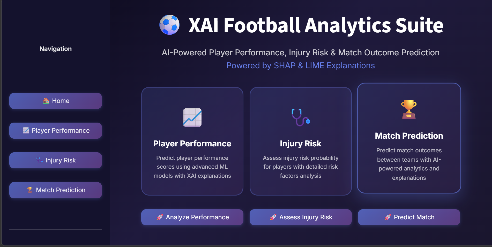

---

## ⚽ Player Performance Analysis

### 🖥️ UI View
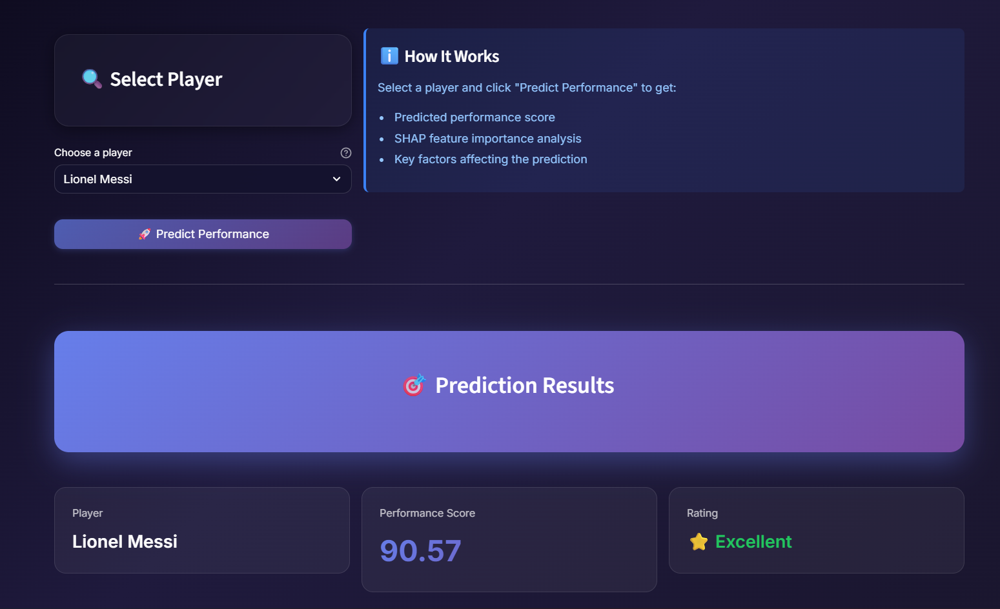

### 📊 Prediction Output
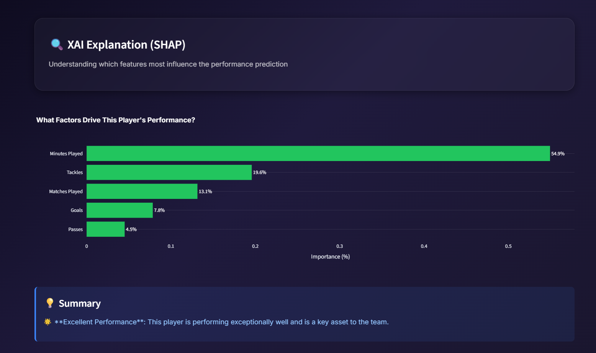

### 📈 Feature Importance
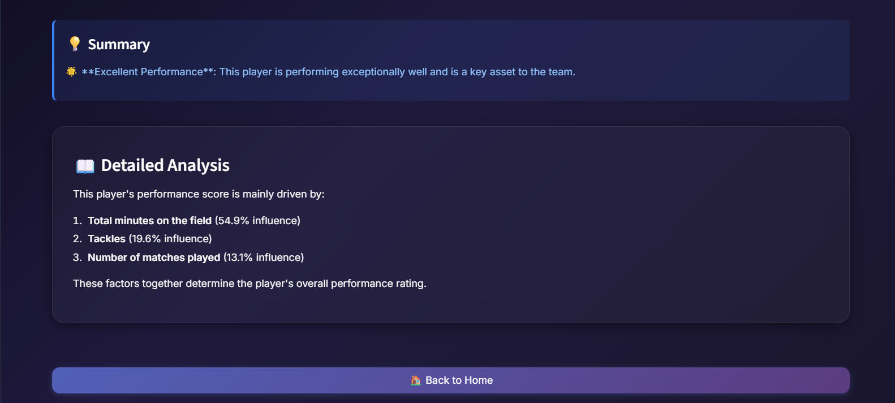

---

## 🏥 Injury Risk Analysis

### 🖥️ UI View
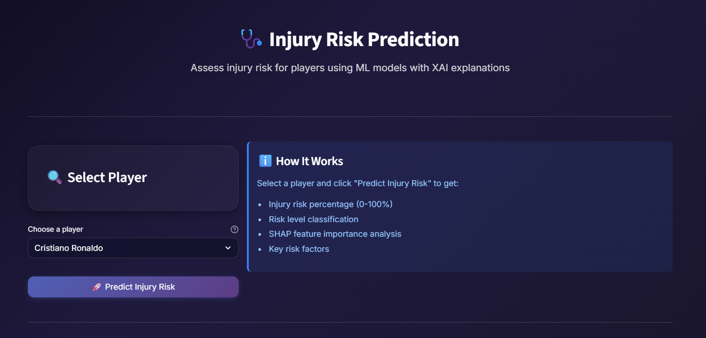

### 📊 Prediction Result
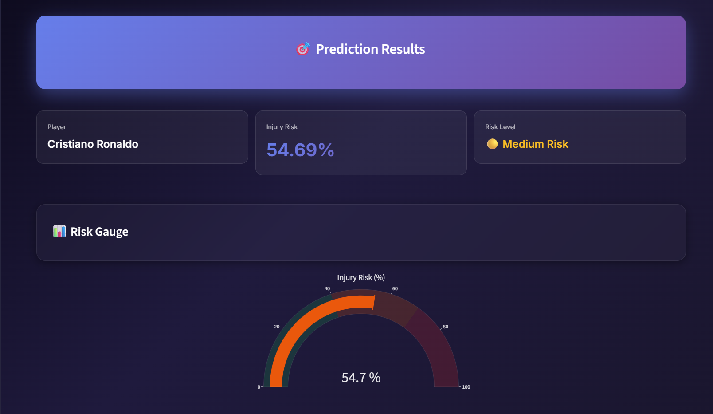

### 📊 Risk Visualization
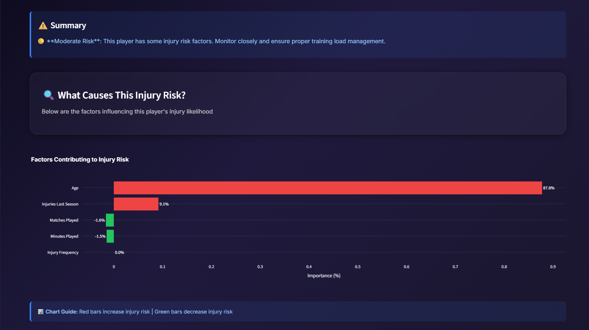

### 📈 Feature Importance
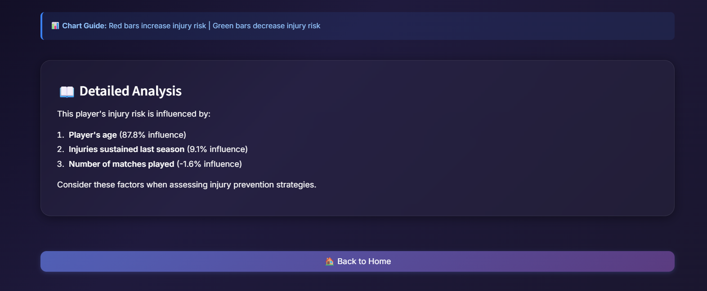

---

## ⚔️ Match Outcome Prediction

### 🖥️ UI Views
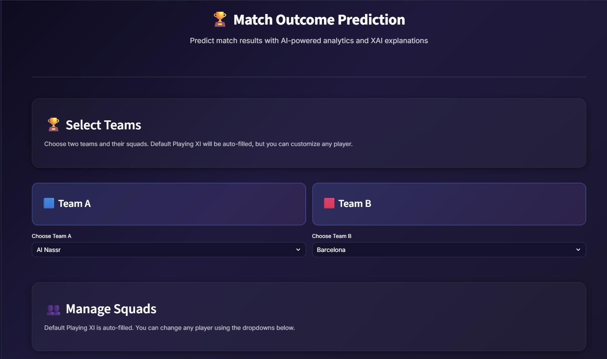
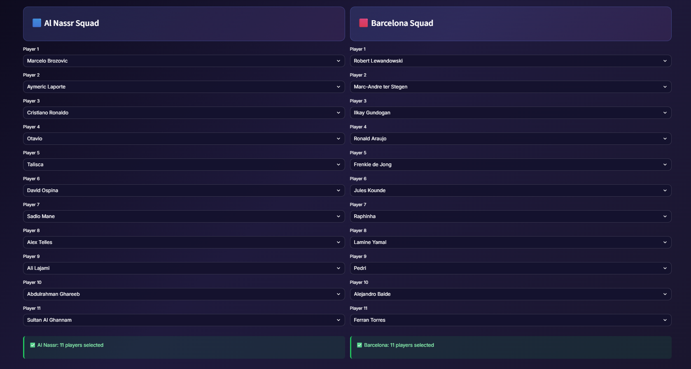

### 📊 Prediction Result
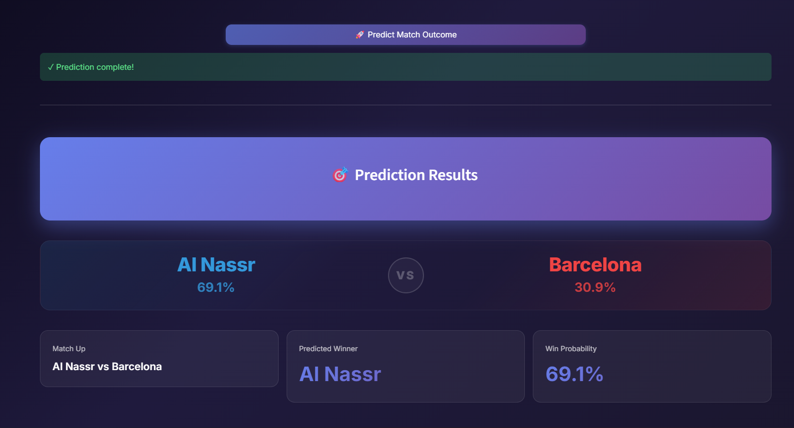

### 📊 Charts
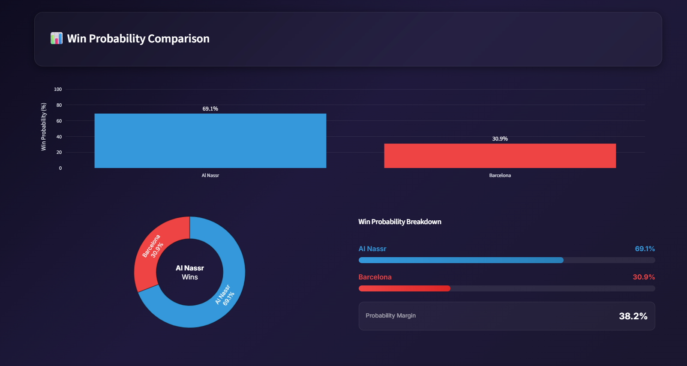
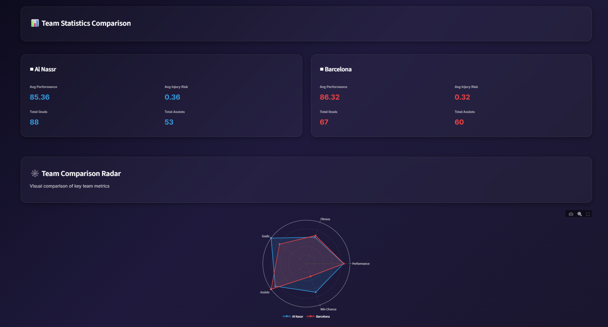

### 📊 Team Comparison
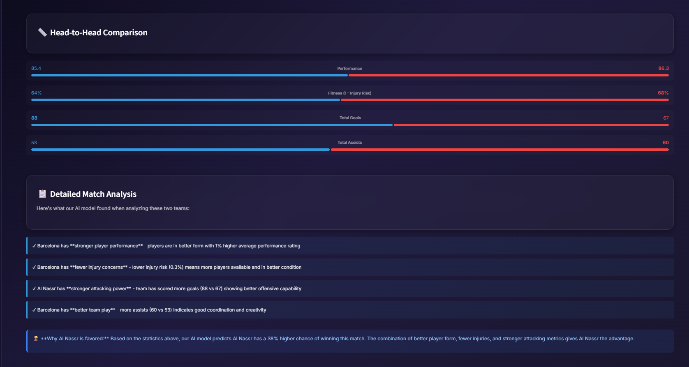

### 📈 Feature Importance
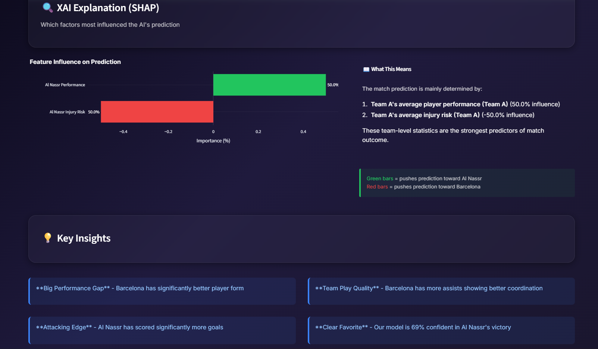

## 📁 Project Structure

```
xai-football-analytics/
├── backend/                    # FastAPI server
│   ├── main.py                # Application entry point
│   ├── config.py              # Configuration settings
│   ├── data_access.py         # Data access layer & feature engineering
│   ├── routers/               # API endpoints
│   │   ├── performance.py     # Performance prediction endpoint
│   │   ├── injury.py          # Injury risk prediction endpoint
│   │   └── match.py           # Match outcome prediction endpoint
│   ├── schemas/               # Request/response schemas
│   └── utils/                 # Utility functions
│       └── load_models.py     # Model loading utilities
│
├── frontend/                   # Streamlit UI
│   ├── app.py                 # Home page
│   ├── style.css              # Styling
│   ├── pages/                 # Page components
│   │   ├── 1_Performance_Analysis.py
│   │   ├── 2_Injury_Risk_Analysis.py
│   │   └── 3_Match_Outcome_Prediction.py
│   └── utils/                 # Frontend utilities
│       ├── api_client.py      # API communication
│       ├── explanation_helper.py  # Explanation formatting
│       └── theme.py           # Theme management
│
├── data/                      # Datasets
│   └── football_master_dataset.csv  # Player statistics (1274 players, 64 teams)
│
├── models/                    # ML Models
│   ├── performance_model_v2.pkl     # XGBoost performance model
│   ├── injury_risk_model_v2.pkl     # XGBoost injury risk model
│   ├── match_outcome_model_v2.pkl   # XGBoost match outcome classifier
│   ├── *_features.pkl              # Feature lists for each model
│   ├── *_label_encoder.pkl         # Label encoders
│   └── metadata/                   # Model metadata
│
├── notebooks/                 # Jupyter notebooks
│   └── 01_data_exploration.ipynb
│
├── logs/                      # Application logs
│
├── requirements.txt           # Python dependencies
└── README.md                  # This file
```

## 🤖 Models & Performance

| Model | Type | Accuracy | Key Metrics |
|-------|------|----------|------------|
| **Performance** | XGBoost Regressor | R² = 0.9885 | 98.85% variance explained |
| **Injury Risk** | XGBoost Regressor | R² = 0.9398 | 93.98% variance explained |
| **Match Outcome** | XGBoost Classifier | 47.5% | Based on squad statistics |

## 📊 Feature Engineering

The system applies **14 engineered features** to each player:

1. **Goals per Match** - Average goals scored
2. **Assists per Match** - Average assists per game
3. **Passes per Match** - Average passes per game
4. **Actions per 90** - Actions normalized per 90 minutes
5. **Shot Accuracy** - Shooting accuracy percentage
6. **Pass Success Rate** - Pass success percentage
7. **Injury Frequency** - How often player gets injured
8. **Is Injury Prone** - Injury susceptibility indicator
9. **High Workload** - High playing time indicator
10. **Full Season** - Plays most of the season
11. **Is Young** - Player age < 25
12. **Is Veteran** - Player age > 32
13. **Is Starter** - Regular starting XI player

## 🔌 API Endpoints

### Performance Prediction
```
POST /api/performance/predict
Body: {"player_name": "Erling Haaland"}
```

### Injury Risk Prediction
```
POST /api/injury/predict
Body: {"player_name": "Erling Haaland"}
```

### Match Outcome Prediction
```
POST /api/match/predict
Body: {
  "team_a": ["player1", "player2", ..., "player11"],
  "team_b": ["player1", "player2", ..., "player11"]
}
```

### Utility Endpoints
```
GET /api/players          # Get all player names
GET /api/teams            # Get all team names
GET /api/squad/{team}     # Get default squad for team
```

## 🛠️ Technology Stack

**Backend:**
- FastAPI - Modern web framework
- XGBoost - Gradient boosting models
- Pandas/NumPy - Data processing
- Scikit-learn - ML utilities
- Joblib - Model serialization

**Frontend:**
- Streamlit - Interactive UI framework
- Plotly - Interactive visualizations
- Pandas - Data handling

**Development:**
- Python 3.10.5
- Virtual Environment (venv)

## 📈 How It Works

1. **Data Input**
   - Select a player or create a team
   - System retrieves player statistics

2. **Feature Engineering**
   - Applies 14 engineered features
   - Normalizes and scales inputs

3. **Model Prediction**
   - XGBoost model makes prediction
   - Calculates prediction confidence

4. **Explanation Generation**
   - Extracts feature importance
   - Generates insights and recommendations
   - Creates visualizations

5. **User Display**
   - Shows prediction with confidence
   - Displays top influencing factors
   - Provides actionable insights

## 💡 Example Usage

### Performance Analysis
1. Go to "Player Performance" page
2. Select a player (e.g., "Erling Haaland")
3. Click "Predict Performance"
4. View:
   - Performance score (0-100)
   - Key factor breakdown
   - Feature importance chart
   - Detailed analysis

### Injury Risk Assessment
1. Go to "Injury Risk Analysis" page
2. Select a player
3. Click "Predict Injury Risk"
4. View:
   - Injury risk percentage (0-100%)
   - Risk level (Low/Medium/High)
   - Risk gauge visualization
   - Contributing factors

### Match Prediction
1. Go to "Match Outcome Prediction" page
2. Select 11 players for Team A
3. Select 11 players for Team B
4. Click "Predict Match Outcome"
5. View:
   - Win probability for each team
   - Team statistics comparison
   - Key factors influencing prediction

## 📦 Dataset

**Source:** Football Master Dataset
- **Total Players:** 1,274
- **Teams:** 64
- **Features:** 15 (age, performance, goals, assists, injuries, etc.)
- **Min Players per Team:** 11
- **Coverage:** Top European and International teams

## 🔒 Data Privacy

- No personal data beyond player statistics
- Aggregated team-level information only
- No external data sharing
- Local processing only

## 🐛 Troubleshooting

### Backend Connection Error
```
Error: Could not connect to backend at http://127.0.0.1:8000/api
Solution: Ensure backend is running on port 8000
```

### Model Loading Error
```
Error: Model file not found
Solution: Verify models/ directory has all required .pkl files
```

### Port Already in Use
```
Error: Address already in use
Solution: Change port or kill existing process
# Windows: netstat -ano | findstr :8000
# Kill: taskkill /PID <PID> /F
```

## 📝 Configuration

Edit `backend/config.py` to customize:
- Model paths
- Dataset location
- Feature names
- Default settings

## 🎓 Learning Resources

- [XGBoost Documentation](https://xgboost.readthedocs.io/)
- [SHAP Explanations](https://github.com/slundberg/shap)
- [FastAPI Tutorial](https://fastapi.tiangolo.com/)
- [Streamlit Docs](https://docs.streamlit.io/)

## 📄 License

This project is licensed under the MIT License - see [LICENSE](LICENSE) file for details.
